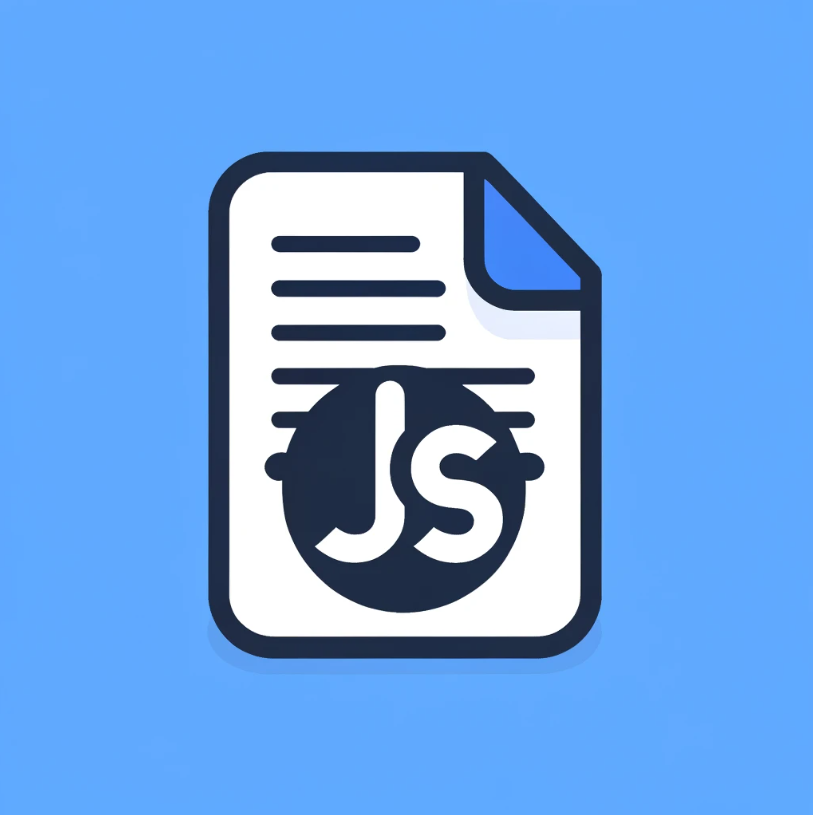

# EasyFormJS


# Google Form Submitter 📃

This package provides a simple way to programmatically submit Google Forms using JavaScript. It is particularly useful for integrating form submission into web projects.


## Installation 🔃

To use EasyFormJS in your project, simply include the script in your **JavaScript** files.

Note that this script does not have an export statement and must be used directly.


## Usage 🤔
Here’s how to use the this package

1. **Initialize Code & url**
    you need to have g form code

    <br/>


    <br />


2. **Initialize GoogleFormSubmitter**
    
   ```javascript
   const googleForm = new GoogleFormSubmitter(url);

    googleForm.setDetail(nimCode, value); //setting what to send
    googleForm.setDetail(nameCode, value); //setting what to send
    googleForm.setDetail(emailCode, value); //setting what to send
    googleForm.setDetail(linkCode, value); //setting what to send

    googleForm.getDetail(code) //prints out value

    googleForm.submit(); //submit form
    ```

    <br />

3. **additional**
    this package comes with an additional function

    ```javascript
    const inputValue = gIT(#id);
    ```

    this fucntion will get value of an element by passing its Id

    <br />
    <br />

# Project Scope 🧐

this Readme is ***Tailored*** only for **HIMTI** project Techtalk


<br />

## Authors &nbsp;&nbsp; o(*￣▽￣*)ブ
**Adrian.P** - [Adr-ian-ba](https://github.com/Adr-ian-ba)


## License 👀

For any additional questions or comments, contact ***Author*** for more information.

---
© 2024 Adrian. All Rights Reserved - Distributed under the MIT License.


